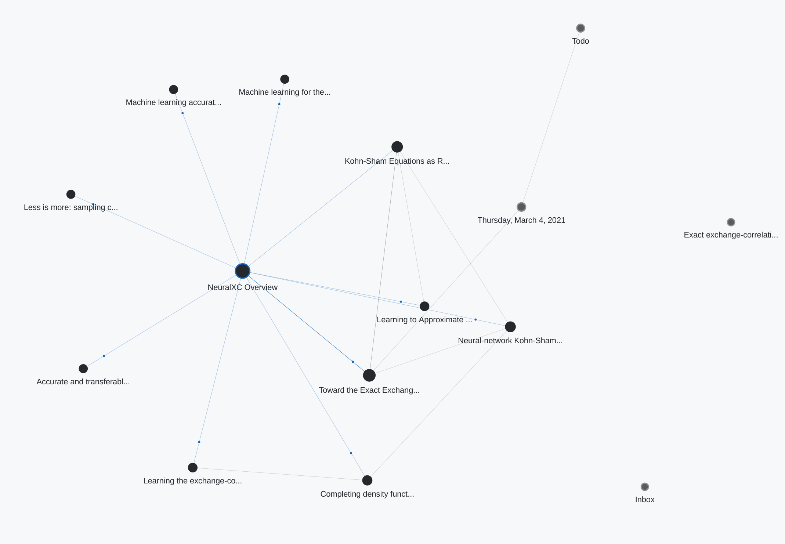

# NeuralXC Overview

**👋 Powered by Foam**

## Introduction

This repository stores the references relevant to [[Toward-the-Exact-Exchange–Correlation-Potential]]

A nice citation graph for [[Toward-the-Exact-Exchange–Correlation-Potential]] can be found [here](https://www.connectedpapers.com/main/d0b44b4f66dcc549ebf40395450520578d8859c0/Toward-the-Exact-ExchangeCorrelation-Potential-a-3D-Convolutional-Neural-Network-Construct/graph)

Another graph derived from Foam 
To interact with Foam, follow the instruction from [foam-template](https://github.com/foambubble/foam-template)

## Repository management

Although it is perfectly fine to directly modify `.md` files using whatever markdown editors you are familiar with, using [foam](https://github.com/foambubble/foam-template) will enable more powerful features such as wiki-links and note graphs.

## Repository structure

- Journals like [[2021-03-04]] is used for house-keeping.
- Action items can be found at [[todo]] (maintenance stuff, non-academic).
- [[inbox]] stores unfiltered unorganized raw information/references, which will later on be organized and put into corresponding references.  

## Resources for deep learning

### Meta-learning 

- Really good comprehensive [Meta-learning lectures](https://cs330.stanford.edu/) by Chelsea Finn.
- Quick bits on Meta-learning: [slides](https://ai.stanford.edu/~cbfinn/_files/samsung_ai_forum.pdf) 
- ICML 2019 Meta-learning [Tutorial with videos](https://sites.google.com/view/icml19metalearning), [slides](https://drive.google.com/file/d/1DuHyotdwEAEhmuHQWwRosdiVBVGm8uYx/view) 

## References for neural XC

| Name                                                         | Authors     | Dataset                          | Model              | Translation invariance     | URL                                                          | Code                                                         | Library     | Year      | Status | Journals | Is-Survey |
| ------------------------------------------------------------ | ----------- | -------------------------------- | ------------------ | -------------------------- | ------------------------------------------------------------ | ------------------------------------------------------------ | ----------- | --------- | ------ | -------- | --------- |
| [[Machine-learning-accurate-exchange-and-correlation]]   Machine learning accurate exchange and correlation functionals of the electronic density |             | MOB-ML24 and MB-Pol9–11, sGDML23 | BPNN               | Symmetrizer                | [paper](https://www.nature.com/articles/s41467-020-17265-7.pdf)       | [neuralxc](https://github.com/semodi/neuralxc)                           | Pytorch, TF | 2020      |        |          | No        |
| [[Learning-the-exchange-correlation-functional]]    Learning the exchange-correlation functional from nature with fully differentiable density functional theory |             | NIST CCCBDB                      |                    |                            | [paper](https://arxiv.org/pdf/2102.04229v1.pdf)                       | [xitorch](https://github.com/xitorch/xitorch)                           | Pytorch     | 2021      |        |          | No        |
| [[Accurate-transferable-multitask-prediction]]    Accurate and transferable multitask prediction of chemical properties with an atoms-in-molecules neural network |             | ANI-1x, Comp6                    | MLP                | Embedding?                 | [paper](https://advances.sciencemag.org/content/5/8/eaav6490)         | [aimnet](https://github.com/aiqm/aimnet)                               | Pytorch     | 2019      |        |          | No        |
| [[Less-is-more]]    Less is more: sampling chemical space with active learning   |             | ANI-1, ANI-1x, Comp6             | Active learning    |                            | [arxiv](https://arxiv.org/pdf/1801.09319.pdf)                         | [ani-tools](https://github.com/Jussmith01/ANI-Tools) [comp6](https://github.com/isayev/COMP6) |             |           |        |          | No        |
| [[Completing-dft-by-ml]]    Completing density functional theory by machine learning hidden messages from molecules | Nagai et al |                                  | MLP                |                            | [nature](https://www.nature.com/articles/s41524-020-0310-0)            | [nnfunctional](https://github.com/ml-electron-project/NNfunctional)          | Pytorch     | 2020/2019 |        |          | No        |
| [[Neural-network-Kohn-Sham-exchange-correlation-potetial]]    Neural-network Kohn-Sham exchange-correlation potential and its out-of-training transferability | Nagai et al |                                  |                    |                            | [arxiv](https://arxiv.org/pdf/1802.02944.pdf)                         |                                                              |             | 2018      |        |          | No        |
| [[Toward-the-Exact-Exchange–Correlation-Potential]]    Toward the Exact Exchange–Correlation Potential: A Three-Dimensional Convolutional Neural Network Construct |             |                                  | 3D CNN             | regularization term (loss) | [jpcl](http://yangtze.hku.hk/home/pub/179.pdf)                       | N/A                                                          |             | 2019      |        |          | No        |
| [[Kohn-Sham-Equations-as-Regularizer]]    Kohn-Sham Equations as Regularizer: Building Prior Knowledge into Machine-Learned Physics | Li Li et al |                                  | Global Convolution |                            | [paper](https://journals.aps.org/prl/pdf/10.1103/PhysRevLett.126.036401) [supp](https://journals.aps.org/prl/supplemental/10.1103/PhysRevLett.126.036401/supp.pdf) | [jax-dft](https://github.com/google-research/google-research/tree/master/jax_dft) | Jax         | 2020      |        |          | No        |
| [[Learning-to-Approximate-Density-functionals]]    Learning to Approximate Density Functionals                  | Li Li et al |                                  |                    |                            | [paper](https://pubs.acs.org/doi/10.1021/acs.accounts.0c00742)        |                                                              |             | 2021      |        |          | No        |
| [[ML-for-the-solution-of-the-Schrödin]]    Machine learning for the solution of the Schrödinger equation |             |                                  |                    |                            | [paper](https://iopscience.iop.org/article/10.1088/2632-2153/ab7d30/pdf) | N/A                                                          |             | 2021      |        |          | Yes       |

[//begin]: # "Autogenerated link references for markdown compatibility"
[Toward-the-Exact-Exchange–Correlation-Potential]: docs/neuralxc-references/Toward-the-Exact-Exchange–Correlation-Potential.md "Toward the Exact Exchange–Correlation Potential: A Three-Dimensional Convolutional Neural Network Construct"
[2021-03-04]: journal/2021-03-04.md "Thursday, March 4, 2021"
[todo]: todo.md "Todo"
[inbox]: inbox.md "inbox"
[Machine-learning-accurate-exchange-and-correlation]: docs/neuralxc-references/Machine-learning-accurate-exchange-and-correlation.md "Machine learning accurate exchange and correlation functionals of the electronic density"
[Learning-the-exchange-correlation-functional]: docs/neuralxc-references/Learning-the-exchange-correlation-functional.md "Learning the exchange-correlation functional from nature with fully differentiable"
[Accurate-transferable-multitask-prediction]: docs/neuralxc-references/Accurate-transferable-multitask-prediction.md "Accurate and transferable multitask prediction of chemical properties with an atoms-in-molecules neural network"
[Less-is-more]: docs/neuralxc-references/Less-is-more.md "Less is more: sampling chemical space with active"
[Completing-dft-by-ml]: docs/neuralxc-references/Completing-dft-by-ml.md "Completing density functional theory by machine learning hidden messages from molecules"
[Neural-network-Kohn-Sham-exchange-correlation-potetial]: docs/neuralxc-references/Neural-network-Kohn-Sham-exchange-correlation-potetial.md "Neural-network Kohn-Sham exchange-correlation potential and its out-of-training transferability"
[Kohn-Sham-Equations-as-Regularizer]: docs/neuralxc-references/Kohn-Sham-Equations-as-Regularizer.md "Kohn-Sham Equations as Regularizer: Building Prior Knowledge"
[Learning-to-Approximate-Density-functionals]: docs/neuralxc-references/Learning-to-Approximate-Density-functionals.md "Learning to Approximate Density Functionals"
[ML-for-the-solution-of-the-Schrödin]: docs/neuralxc-references/ML-for-the-solution-of-the-Schrödin.md "Machine learning for the solution of the Schrödinger equation"
[//end]: # "Autogenerated link references"

